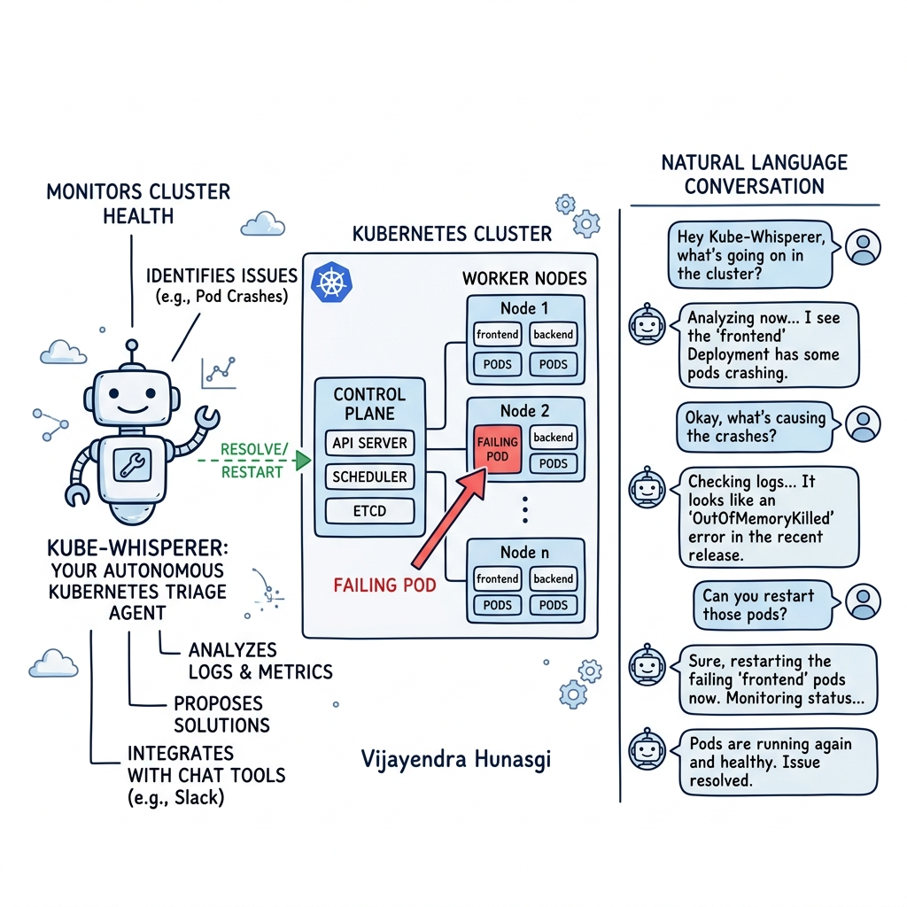
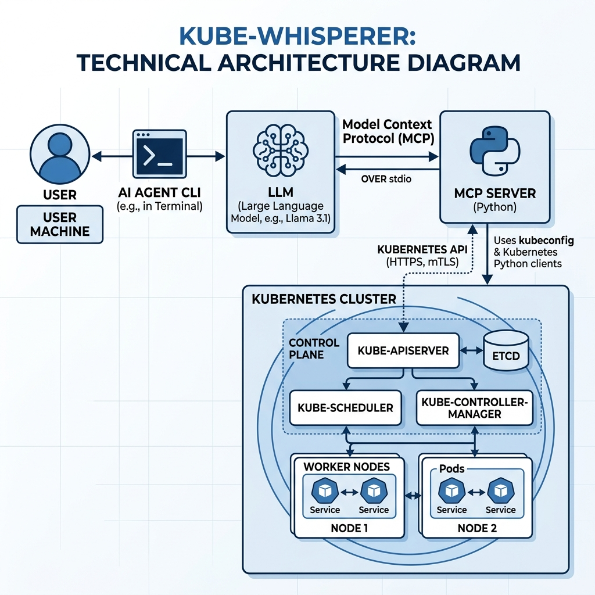

# 🚀 Kube-Whisperer 

**Autonomous AI Agent for Kubernetes Triage & Infrastructure Management**

Kube-Whisperer is an experimental, fully autonomous AI agent built on the **Model Context Protocol (MCP)**. It bridges the gap between Large Language Models and your Kubernetes clusters, allowing you to manage, debug, scale, and provision your infrastructure entirely through natural language conversations.

---

## 📖 Table of Contents
1. [What is Kube-Whisperer?](#-what-is-kube-whisperer)
2. [Architecture Overview](#-architecture-overview)
3. [Features & Capabilities](#-features--capabilities)
4. [Prerequisites](#-prerequisites)
5. [Installation & Setup](#-installation--setup)
6. [Usage Guide](#-usage-guide)
7. [Project Structure](#-project-structure)

---

## 🤖 What is Kube-Whisperer?



Managing Kubernetes can be complex and verbose. When a pod crashes, DevOps engineers typically run a series of commands (`kubectl get pods`, `kubectl describe`, `kubectl logs`) to triage the issue. 

**Kube-Whisperer automates this.**
Powered by a locally running LLM (e.g., Llama 3.1) and standard Kubernetes Python clients, Kube-Whisperer acts as a highly intelligent operator inside your cluster. You can ask it to "find out why my apps are crashing" or "spin up a new namespace and deploy this YAML file," and it will autonomously select the right tools, execute the API calls, and report back to you in plain English.

---

## 🏗️ Architecture Overview



The project is built around the **Model Context Protocol (MCP)**, which provides a standardized way for AI models to interact with external tools and data sources.

- **MCP Server (`server.py`)**: A Python-based server that securely interfaces with your `kubeconfig` and the Kubernetes API. It exposes a strict set of predefined "tools" (e.g., `list_pods`, `deploy_yaml`) and handles argument validation to prevent rogue commands.
- **AI Agent CLI (`agent_cli.py`)**: The conversational interface. It connects to the MCP Server over `stdio`, fetches the available tools, translates them into a schema that the LLM understands, and orchestrates the chat loop. The Agent evaluates your requests, decides which tools to call, and parses the JSON results back into natural language.

---

## ✨ Features & Capabilities

The agent is currently equipped with **13 core infrastructure tools**:

### 🔍 Intelligent Triage
- **`list_pods`**: Lists all pods in a namespace alongside their current lifecycle phase.
- **`get_pod_status`**: Deep dives into a specific pod, retrieving restart counts and failure conditions.
- **`get_pod_logs`**: Streams the tail logs from a failing container to diagnose application-level errors.

### ⚡ Self-Healing & Management
- **`delete_pod`**: Forcefully restarts stuck pods by deleting them.
- **`list_deployments`**: Views deployment rollout status and replica health.
- **`scale_deployment`**: Dynamically scales replica sets up or down based on your instructions.
- **`restart_deployment`**: Triggers a zero-downtime rolling restart for a deployment.
- **`delete_deployment`**: Tears down deployments.
- **`list_services`**: Inspects cluster networking and exposed NodePorts/LoadBalancers.

### 🏗️ Infrastructure as Conversation
- **`list_namespaces`**: Maps out the entire cluster's namespace landscape.
- **`create_namespace`**: Provisions new logical boundaries on the fly.
- **`deploy_yaml`**: Dynamically reads local YAML files and deploys them to a target namespace.
- **`create_cluster`**: Interacts with the host OS to spin up brand new local Kubernetes clusters using engines like `minikube` or `kind`!

---

## 📋 Prerequisites

Before running Kube-Whisperer, ensure you have the following installed:
- **Python 3.10+**
- **Kubernetes Cluster**: A local cluster (MicroK8s, Minikube, or Kind) or a remote cluster.
- **Kubeconfig**: Your `~/.kube/config` must be properly configured and authenticated with your target cluster.
- **Ollama / LLM Provider**: An LLM endpoint compatible with the OpenAI spec (the CLI defaults to looking for a local instance).

---

## 🚀 Installation & Setup

1. **Clone the Repository**
   Navigate to your workspace and ensure you are in the `kube_whisperer` directory.

2. **Set up the Virtual Environment**
   ```bash
   python3 -m venv .venv
   source .venv/bin/activate
   ```

3. **Install Dependencies**
   Install the required packages from the `requirements.txt` file into your virtual environment:
   ```bash
   pip install -r requirements.txt
   ```

---

## 💬 Usage Guide

To start chatting with your cluster, simply run the Agent CLI:

```bash
.venv/bin/python agent_cli.py
```

Upon startup, the agent will initialize the connection to the MCP server, load the available tools, and present a **Main Menu** of its capabilities.

### Example Interactions

**Example 1: Triaging a Crash**
> **You:** "Are there any pods crashing in the broken-apps namespace?"
> **Agent:** *(Calls `list_pods` -> Calls `get_pod_status` -> Calls `get_pod_logs`)* "I found a pod in CrashLoopBackOff. The logs indicate it ran out of memory. Would you like me to restart the deployment?"

**Example 2: Deploying Infrastructure**
> **You:** "Deploy the kube-whisperer-web.yaml file into the nginx-webserver namespace."
> **Agent:** *(Calls `deploy_yaml` passing the dynamic namespace)* "I have successfully deployed the resources into the nginx-webserver namespace!"

**Example 3: Cluster Management**
> **You:** "Spin up a new minikube cluster named testing-env."
> **Agent:** *(Calls `create_cluster`)* "I've started the minikube provisioning process. The testing-env cluster is now coming online."

---

## 📁 Project Structure

- **`agent_cli.py`**: The conversational AI frontend and reasoning loop.
- **`server.py`**: The MCP backend that interacts directly with the Kubernetes API.
- **`test_mcp.py`**: A utility script for testing MCP tool calls directly without the LLM.
- **`kube-whisperer-web.yaml`**: A sample enterprise-grade landing page configured as a Kubernetes ConfigMap and NGINX Deployment.
- **`oom-deployment.yaml`**: A sample crashing deployment used for testing the agent's triage capabilities.

---
*Built with ❤️ and MCP.*
